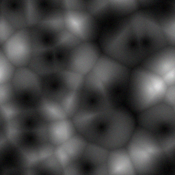

# cobble

a library for procedural generation of tileable 2d textures.

textures are created from a directed acyclic graph of nodes, which can either
generate, modify, or combine other textures. primitivies such as voronoi,
simplex, convolutions, and mixes are provided.

    a := voronoi(50) -> invert
    b := voronoi(20)
    c := (a, b) -> math(Multiply)
    
    (c, random) -> mix -> return

## details

the main idea behind this library is that each non-local primitive (like the
voronoi diagram or the simplex noise) uses a coordinate system that is more like
a flat torus. the consequence of this is that the bottom and top edges, and the
left and right edges line up. the same goes for processors like convolutions,
which wrap around near the edges here.
